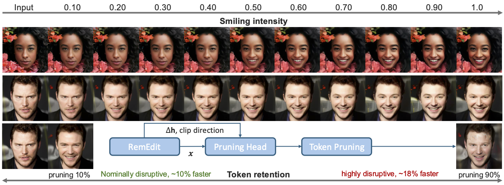
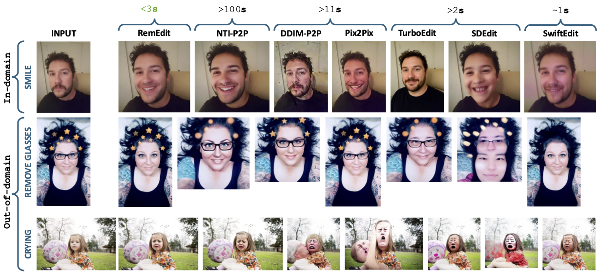

# RemEdit: Efficient Diffusion Editing with Riemannian Geometry  
[Eashan Adhikarla](https://eashanadhikarla.github.io/), Brian D. Davison

[](./LICENSE)
[](#)
[](#)

This repository is the official implementation of **"RemEdit: Efficient Diffusion Editing with Riemannian Geometry"** by Adhikarla et al. (2025).

---

<p align="center">
  
</p>

<p align="center">
  
</p>

---

## Overview

RemEdit introduces a unified framework for efficient, high-quality diffusion image editing by combining:

- **Riemannian-geometry based editing**  
  Geodesic distances enable smoother, semantically consistent traversal of the feature manifold.

- **Dual-mode SLERP interpolation**  
  - **Inner SLERP** on the h-space manifold to generate coherent edit directions.  
  - **Outer SLERP** to control edit strength and blend seamlessly with the original image.

- **Lightweight pruning**  
  Reduces unnecessary computation, enabling faster inference without quality loss.

This framework is designed for environments where strong generative editing performance must coexist with efficiency constraints.

---

## Installation and Requirements

### Create the conda environment
```bash
conda env create -f environment.yml
conda activate asyrp2
```

### Key Library Versions
The environment is built with the following key dependencies. Please ensure your setup matches these versions for reproducibility:
| Library | Version |
| :--- | :--- |
| **Python** | 3.11.3 |
| **PyTorch** | 2.0.1 |
| **TorchVision** | 0.15.2 |
| **CUDA** | 11.7 |
| **CuDNN** | 8.5.0 |
| **TensorFlow** | 2.12.0 |
| **NumPy** | 1.23.5 |
| **OpenCV** | 4.6.0 |

### Dataset and Pretrained Model Setup
Download the CelebA-HQ dataset into src/data/ and diffusion model weights into src/pretrained/:
```bash
bash src/lib/utils/data_download.sh celeba_hq src/
rm a.zip

mkdir src/lib/asyrp/pretrained/
python src/utils/download_weights.py
```

## Getting Started
We recommend an NVIDIA GPU with at least 32 GB VRAM, along with CUDA and CuDNN installed.

Typical Workflow
1.	Pre-compute latent h-space representations for your dataset.
2.	Compute attribute directions (PCA, mean-difference, etc.).
3.	For editing:
    - Project a target image to h-space
    - Travel along the geodesic direction using inner SLERP
    - Decode with outer SLERP to control edit strength
4.	Optionally enable pruning to accelerate inference.

All supporting scripts are available in src/scripts/.

### Training and Inference 
Training and inference utilities for RemEdit are located under: [`src/scripts/`](src/scripts/).

### Supported Pretrained Models
RemEdit supports the following diffusion checkpoints (similar to [Asyrp](https://github.com/kwonminki/Asyrp_official)): 
| Image Type to Edit |Size| Pretrained Model | Dataset | Reference Repo. 
|---|---|---|---|---
| Human face |256×256| Diffusion (Auto) | [CelebA-HQ](https://arxiv.org/abs/1710.10196) | [SDEdit](https://github.com/ermongroup/SDEdit)
| Human face |256×256| [Diffusion](https://1drv.ms/u/s!AkQjJhxDm0Fyhqp_4gkYjwVRBe8V_w?e=Et3ITH) | [CelebA-HQ](https://arxiv.org/abs/1710.10196) | [P2 weighting](https://github.com/jychoi118/P2-weighting)
| Human face |256×256| [Diffusion](https://1drv.ms/u/s!AkQjJhxDm0Fyhqp_4gkYjwVRBe8V_w?e=Et3ITH) | [FFHQ](https://arxiv.org/abs/1812.04948) | [P2 weighting](https://github.com/jychoi118/P2-weighting)
| Dog face |256×256| [Diffusion](https://1drv.ms/u/s!AkQjJhxDm0Fyhqp_4gkYjwVRBe8V_w?e=Et3ITH) | [AFHQ-Dog](https://arxiv.org/abs/1912.01865) | [ILVR](https://github.com/jychoi118/ilvr_adm)

Additional notes:
- Models for CelebA-HQ and LSUN are automatically downloaded (from DiffusionCLIP).
- For all other datasets, manually place checkpoints into ./pretrained/.
- Modify paths in ./configs/paths_config.py if needed.
- We recommend P2-weighted models over SDEdit for best results.

### Datasets 
To compute latent h-space directions, you need roughly 1000+ images.
These may be:
- Generated samples from the pretrained diffusion model
- Real images from the original training dataset

### Custom Dataset Support
Use:
```
config/custom.yml
```
Key fields:
- data.dataset: must match domain (e.g., CelebA_HQ, FFHQ)
- data.category: set to "CUSTOM"

Provide dataset paths via:
```
--custom_train_dataset_dir "path/to/train" \
--custom_test_dataset_dir  "path/to/test"
```

### LPIPS distances Computation
LPIPS distances for `CelebA-HQ`, `LSUN-Church`, and `AFHQ-Dog` are precomputed in `./utils`.
To compute LPIPS for a new dataset:
```
python main.py --lpips \
               --config $config \
               --exp ./runs/tmp \
               --edit_attr test \
               --n_train_img 100 \
               --n_inv_step 1000
```

## Pre-trained Models
You can download our pre-trained models results via [our Google Drive directory]().

## Acknowledge
Codes are based on [Asyrp](https://github.com/kwonminki/Asyrp_official) and [DiffusionCLIP](https://github.com/gwang-kim/DiffusionCLIP).